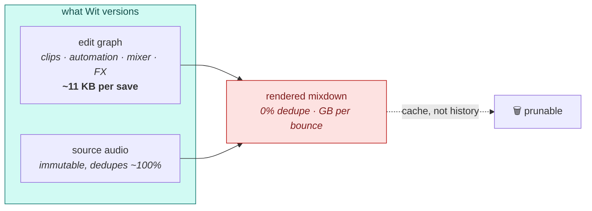

<h1 align="center">Wit</h1>

<p align="center">
  <strong>Version control for music projects.</strong><br>
  Git for waves — know what changed in a session, not which ZIP is newest.
</p>

<p align="center">
  <a href="LICENSE"></a>
  
  <a href="docs/EXPERIMENTS.md"></a>
  <a href="CONTRIBUTING.md"></a>
</p>

<p align="center">
  <a href="#the-problem">Problem</a> ·
  <a href="#what-we-proved">What we proved</a> ·
  <a href="#how-it-works">How it works</a> ·
  <a href="#quick-start">Quick start</a> ·
  <a href="#where-to-start-contributing">Contribute</a>
</p>

---

## The problem

Two producers want to work on the same track. Today there are two options, and both are bad:

| | What you send | Why it hurts |
|---|---|---|
| **Send the project** | 2–26 GB | Slow, and it still cannot tell you *what changed* |
| **Send the stems** | a few hundred MB | A photograph, not a recipe — they can hear it, not edit it |

So everyone falls back to `Final_v3_REAL_final_2.zip`.

Here is a real, untouched Logic folder — 30 projects, **26 GB**:

```
Alex & Sep Project 1 WIP.logicx        127M
Alex & Sep Project 1 TEST.logicx       116M   ← same song, copied to "branch"
Pr0oject 5 DESERT.logicx               572M
Pr0oject 5 SAD DESERT.logicx           743M   ← same song again
Project 5 – Intro.logicx               777M   ← and again
Joana I don't know the style.logicx    101M
Sep Kevin Stuff on Joana I don't ...   236M   ← a collaborator's edit, as a full copy
```

**5.38 GB of it (24.5%) is byte-for-byte duplicate audio** — measured. That is what
branching-by-`Save As` costs, and nobody gets version history in return.

## What we proved

Before writing a line of product code, we measured whether this is even possible — on
real commercial-grade sessions, not synthetic fixtures. Every number is reproducible;
method in **[docs/EXPERIMENTS.md](docs/EXPERIMENTS.md)**.

**1. A DAW save is a tiny change wearing a big costume.**

```
Changed lines per Ableton save, out of 232,000:

 save 3→4   ▏ 202     0.09%
 save 4→5   ▏ 168     0.07%
 save 6→7   ▏ 170     0.07%
 save 7→8   ▎ 408     0.18%
 save 9→10  ▎ 517     0.22%
```

And the content is not what you would guess: one 202-line diff was *entirely* a sample
being renamed; a 170-line diff was *entirely* scroll position and zoom.

**2. Version history is essentially free.**

```
29 versions of one real Ableton project

  keep every version (today)   ████████████████████████████  269.8 MB
  git, after gc --aggressive   ▏                               0.8 MB
  Wit delta chain              ▏                               0.3 MB   ← 11 KB / save
```

**3. But versioning rendered audio is impossible — and this is the finding that
determines the whole design.**

A producer changes one EQ band and re-renders a stem. It still *sounds* 95% the same.
But every sample value is now a different number, so there is nothing to reuse:

```
Bytes reusable from the previous render of the same 19.6 MB stem

  moved in time (+250ms)      ███████████████████████████████████  99.6%
  one 5s section re-rendered  ██████████████████████████████████   93.0%
  EQ changed, whole track     ▏                                     0.00%   ← the wall
```

Git agrees: it deltas the localized edit for **+1.1 MB**, and the global one for
**+16.8 MB — a full second copy**. No algorithm can do better; there is genuinely no
shared byte sequence. Perceptual similarity is not byte similarity.

**4. So: version the recipe, not the render.** And when you do, on a real 26 GB library:

```
  today                        ████████████████████████████████  26.0 GB   no history
  Wit (dedup + FLAC + deltas)  ██████████                         8.1 GB   full history
```

**Smaller than what you have now, while adding the history you don't have.**

## How it works

A music project is already a program: immutable source recordings plus a tree of
non-destructive operations that renders to audio. Wit versions that, and treats renders
the way you treat `node_modules` — rebuildable, not history.



Storage matches the content, because the two behave in opposite ways:

| Content | Behaviour | Strategy |
|---|---|---|
| Project files | rewritten every save, ~0.1% different | **delta chains** (`zstd --patch-from`) |
| Source audio | written once, never changes, repeats across projects | **content-addressed**, FLAC, chunked |
| Renders / freezes | derived (52% of one real project's audio!) | **cache namespace**, prunable |

A diff you can actually read:

```
$ wit diff v3 v4
  MIX~    [Stem-mixing] volume: 0.794 -> 0.525
  CLIP~   [Corpus metal] 'Wood hits' bar 480.0-495.5 -> 480.0-496.0
  FX+     [Round] added: AutoFilter
  SAMPLE~ 'kick_old.wav' -> 'kick_final.wav'  (418 clip references)
```

That last line matters: one sample rename fans out to 418 clip changes in the raw file.
Coalescing it turned a 425-line diff into 3 readable lines.

## Quick start

Nothing to install — the prototypes are Python 3.9+, standard library only, so you can
point them at **your own sessions** right now.

```bash
git clone https://github.com/sep-lab/Wit.git && cd Wit
```

**See a semantic diff of your own Ableton project.** Live keeps timestamped autosaves in
your project's `Backup/` folder, so you already have a version chain:

```bash
python3 experiments/als_semantic_diff.py --chain '/path/to/YourProject/Backup/*.als'
```

**Measure what version history would cost you:**

```bash
./experiments/storage_bench.sh '/path/to/YourProject/Backup'      # needs zstd + git
```

**Survey an FL Studio project:**

```bash
python3 experiments/flp_parse.py '/path/to/project.flp'
```

**Reproduce the audio result** (needs `ffmpeg`) — this is the one that decides the
architecture, and it is worth running yourself:

```bash
python3 experiments/cdc_dedup.py original.wav re_rendered.wav
```

## Repo map

```
docs/
  EXPERIMENTS.md      every measurement, method, and limitation      ← start here
  FORMATS.md          what each DAW writes to disk, and what's unknown
  decisions/          ADRs — the design, and what would overturn it
experiments/
  als_semantic_diff.py  Ableton → readable diff
  cdc_dedup.py          chunking / dedup harness
  flp_parse.py          FL Studio event-stream survey
  storage_bench.sh      naive vs git vs delta chain
```

## Status

**Design phase.** There is no installable `wit` binary yet — do not point this at work you
care about. What exists is the research, the measurements, and the architecture decisions
they justify, plus the prototypes that produced every number above.

Production core will be Rust ([ADR-0004](docs/decisions/0004-implementation-stack.md));
`experiments/` stays dependency-free Python on purpose, so musicians and engineers can
both run it. Next steps: [docs/ROADMAP.md](docs/ROADMAP.md).

## DAW support

Gated by how open each format is:

| DAW | Format | Status |
|---|---|---|
| **Ableton Live** | gzipped XML | 🟢 First target — stable IDs, diffs and merges cleanly |
| **Logic Pro** | chunked binary | 🟢 Container decoded; ~0.3% delta per save |
| **GarageBand** | *same container as Logic* | 🟢 One parser covers both |
| **FL Studio** | typed event stream | 🟡 Good ≤ v24; v25 adds an obfuscation keystream |
| **Studio One** | ZIP + XML | 🟡 Promising, unverified by us |
| **Cubase** | MFC object stream | 🔴 No parser reads modern files |
| **Pro Tools** | obfuscated TLV | 🔴 Legal risk; storage-only support at most |

Wit starts with Ableton because it enables the *best diff*, not because it is the biggest.
Excellent for one DAW beats mediocre for five. Details: [docs/FORMATS.md](docs/FORMATS.md).

## FAQ

**Why not just use git + LFS?**
Git is fine for the project file — it got within 3× of our delta chain on `.als`. Git
fails on **audio**, storing a full copy per re-render. And LFS does not fix that; it just
moves the copies elsewhere. The project file was never the problem.

**Do plugins matter, if an EQ just changes the wave anyway?**
If you version only audio — correct, they do not. But then your collaborator cannot
*change* the EQ, and editability is the entire reason to send a project. So Wit tracks
plugin state as an opaque blob (detect "the compressor changed"), records which plugins a
session needs, and never tries to port state between DAWs.
[ADR-0003](docs/decisions/0003-plugin-state-policy.md).

**Will it convert my Logic project to Ableton?**
No, and be sceptical of anything claiming to. `logic2ableton`, often cited as proof this
is solved, recovers **zero MIDI notes** from real modern Logic projects — details in
[FORMATS.md](docs/FORMATS.md).

**Is this a hosting service?**
No. Wit is the version control layer — local-first, no account, no server.

## Where to start contributing

Genuinely open problems, roughly by size. Full guide in
**[CONTRIBUTING.md](CONTRIBUTING.md)**.

| | Task | Why it matters |
|---|---|---|
| 🟢 | **Run the experiments on your own sessions** and report numbers | Everything so far is measured on a handful of projects. Breadth is the gap. |
| 🟢 | **Write up how your studio actually collaborates** | Shapes the roadmap more than feature requests do |
| 🟡 | **Model device *parameters* in the Ableton extractor** | Biggest known gap — the differ currently misses knob-only changes |
| 🟡 | **Map more Logic `ProjectData` chunk payloads** | Container is decoded; payload schemas are not |
| 🔴 | **Verify a Wit-merged `.als` opens in Live** | Untested, and a release gate |
| 🔴 | **Solve the FL Studio v25 scalar keystream** | Blocks modern FL support |

You do not need to be a systems programmer. If you have shipped a session to a
collaborator and it went badly, you have information this project needs.

## License

[Apache License 2.0](LICENSE) · [Code of Conduct](CODE_OF_CONDUCT.md) · [Security](SECURITY.md)
