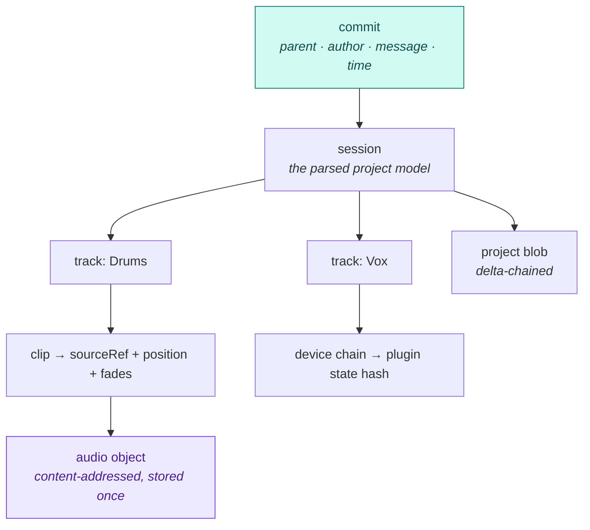
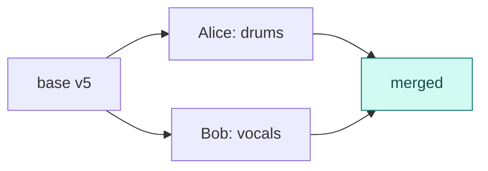
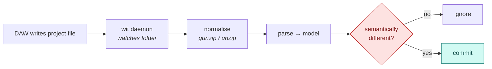

# Architecture

How Wit is put together, and — since the question comes up constantly — **which of git's
ideas we take, which we adapt, and which we deliberately reject.**

Git is a version control system specialised for source code. Wit is not built *on* git.
But git solved a set of problems that recur here, and its design is the best-tested
reference available. Copying the right parts is free; copying the wrong parts is how this
project fails.

---

## 1. The object model

A Wit repository is a **content-addressed immutable object store with a commit DAG**.
A version is one root hash. Deduplication is a structural consequence, not a feature to
be built.



**Hash: BLAKE3, with an algorithm tag in every object and pointer from day one.** This is
a decide-once choice. Git's SHA-1 → SHA-256 migration has taken nine years, required
translation tables and dual signatures, and still is not the default. We are not
repeating that.

### What a commit contains

- A pointer to the parsed **session model** (tracks, clips, automation, mixer, devices).
- Content hashes for every referenced **audio object** and **plugin state blob**.
- The **verbatim original project file**, delta-chained — so Wit can always reproduce
  exactly what the DAW wrote, including everything it does not model.
- Environment: DAW name and version, sample rate, plugin requirements.

That third point is a hard rule. **Wit must never be the reason a session fails to open.**
Unmodelled bytes round-trip untouched.

---

## 2. Storage

Covered in detail in [ADR-0002](decisions/0002-storage-model.md). In short:

| Content | Behaviour | Strategy |
|---|---|---|
| Project files | rewritten each save, ~0.1% different | delta chains (`zstd --patch-from`), ~11 KB/save |
| Source audio | write-once, recurs across projects | content-addressed + CDC + FLAC |
| Renders / freezes | derived | cache namespace, prunable |

Two rules do most of the work:

**Normalise the container before hashing.** `.als` is gzip. Hashing the gzip stream makes
every save look unrelated. Gunzipping first cut a 10-version repo **7×** and cut marginal
cost per save **30×** (472 KiB → 15.7 KiB) — while the working-tree file remains a
byte-valid `.als` that Live opens. The same applies to Studio One's ZIP and to FL's
zlib-wrapped plugin state.

**Bound reconstruction cost.** Chained deltas mean restoring version *k* costs *k* patch
applications. Git's `pack.depth` of 50 is fine for source files and unacceptable for a
500 MB stem when a producer hits play. Re-insert a full snapshot whenever a chain would
cost more than a full read — Mercurial's revlog rule.

---

## 3. Diff

Diff is where Wit earns its keep, and it is modelled directly on git's `textconv`: a
converter that renders an opaque file into something diffable, so the generic machinery
does useful work.

Wit's version parses the project into a semantic model and diffs *that*:

```
MIX~    [Stem-mixing] volume: 0.794 -> 0.525
CLIP~   [Corpus metal] 'Wood hits' bar 480.0-495.5 -> 480.0-496.0
FX+     [Round] added: AutoFilter
SAMPLE~ 'kick_old.wav' -> 'kick_final.wav'  (418 clip references)
```

Two design rules learned from real output:

- **Coalesce fan-out.** One sample rename rewrote 418 clip references and produced a
  425-line diff. Detecting the rename once collapses it to a single line. Without this,
  diffs are technically correct and practically unreadable.
- **Say "nothing changed" when nothing changed.** Real save chains contain saves with no
  musical content at all — pure scroll and zoom. Reporting that plainly builds more trust
  than inventing changes.

### Visual diff — cheap, and worth building early

8-bit min/max **peak data is 0.008%–0.13% of the source audio**, so showing two versions
of a waveform side by side never touches the samples. This is the cheapest large win
available: an audible/visible "what changed" without decoding anything. BBC's
`audiowaveform` defines a good peak format (check its GPL-3.0 licence before linking).

### Time representation

Adopt **OpenTimelineIO's `RationalTime` / `TimeRange`** rather than inventing one.
Verified drift-free at audio rates: one million sample-additions at 48 kHz accumulate zero
error. Sample-accurate rational time is not a detail — floating-point positions silently
drift and produce phasing.

Adopt OTIO's time model and its reference-not-embed media model. Do **not** adopt its
effects model: `Effect` is a near-empty stub, and the plugin chain is precisely where Wit
has to be strong. Extend via registered schema definitions and namespaced metadata.

---

## 4. Merge

**Merge is first-class, modelled on git's merge-driver contract** (`%O` ancestor, `%A`
ours, `%B` theirs; exit 0 = clean, non-zero = conflict).

This matters more than it sounds. Without a driver, two people editing *different tracks*
of the same session get `Cannot merge binary files` and somebody loses work. With
track-aware merge, it resolves cleanly — and edits really are localized: measured, a
median of **3 of 28 tracks** change per save.



**Conflict policy — three tiers:**

1. **Auto-merge** — different tracks, or different non-overlapping clips on one track.
2. **Ask the human** — same track, same parameter; both edited the same plugin's state
   (opaque blobs cannot be merged, only chosen between).
3. **Refuse and lock** — project-global properties where a merge is meaningless: tempo
   map, time signature, sample rate. Changing these re-times everything downstream.

For tier 3, and for genuinely unmergeable artifacts (bounced masters, comped vocals,
Melodyne'd takes), Wit takes **Perforce's answer rather than git's: advisory and exclusive
locking**. An honest "Sarah has this checked out" beats any merge algorithm, and it is the
main reason artists prefer Perforce over git. This is a feature, not an admission of
defeat.

---

## 5. Client integration



v1 is a **filesystem watcher**, not a DAW plugin: it works across every DAW without SDK
permission, and needs nothing from the vendors.

Change detection keeps git's **stat cache** (size/mtime/inode per path, plus an fsmonitor
daemon) so Wit can spot changes across gigabytes without hashing everything.

But note the trap, which we measured: **a changed file hash does not mean the music
changed.** Three consecutive Logic saves had identical record censuses — no semantic
change — yet differed in 97 and 140 bytes, because a plugin-state UUID is regenerated
every save and ~20 float32s are rewritten at a fixed stride. **Dirty detection must
compare parsed models**, or Wit spams users with empty commits.

---

## 6. What we take from git — and what we refuse

### Adopt

| Idea | Why it fits music |
|---|---|
| **Content-addressed store + commit DAG** | Git's best idea. The same sample recurs across sessions, projects and collaborators; dedup should be free. |
| **CDC at chunk granularity** (à la Xet) | Boundary stability makes trims and shifts cheap. Fixed-size chunking invalidates everything after an edit. |
| **clean/smudge normalisation boundary** | The single highest-leverage detail: 7× repo reduction, 30× lower per-save cost. |
| **Merge drivers** | Turns "binary conflict, someone loses" into a clean auto-merge. |
| **`textconv` semantic diff** | The whole "what changed since yesterday?" feature, cheaply. |
| **The reflog** | Always-on undo that does *not* require having committed first. Musicians already hand-roll this — badly — as 30 timestamped files in `Backup/`. |
| **Plumbing/porcelain split** | Git's third-party ecosystem exists because of this. Build the scriptable core first. |
| **Partial/lazy materialisation** | Never clone whole history. Stream only the stems a session references. Mandatory at these file sizes. |

### Reject

| Idea | Why it fails here |
|---|---|
| **The staging area / `git add`** | A DAW save is atomic. The mental model is "the session as it is now". An index would be the biggest source of confusion for non-programmers, for zero benefit. |
| **Whole-history-by-default clone** | A collaborator needs today's session, not every bounce ever made. |
| **Loose objects then `gc`** | Git ballooned to 101 MB of loose objects for a 50 MB file before reclaiming to 51 MB. Chunk and dedup on write; compaction must be incremental and background — never a blocking stall mid-session. |
| **Line-oriented text merge as the default** | Works by luck when edits are far apart. Merge the object model instead. |
| **Rebase and history rewriting** | Engineer-shaped tools that map badly onto how music is made. |
| **Patch theory (Pijul/Darcs)** | Optimised for reordering fine-grained text patches, which musicians do not do. Darcs's exponential conflict merges are a standing warning. Snapshot + semantic merge is the right bet. |
| **git + LFS as the architecture** | LFS dedups only byte-identical whole files, capturing none of the delta wins. It is the competitor to beat, not the model to copy. |

### One correction worth stating plainly

**Git's delta engine is much better than its reputation, and Wit should not be justified
on folklore.** Measured: a 50 MB WAV committed twice with a 1-byte change costs **1,409
bytes** after `gc`. Prepending a second of silence to a 10 MB WAV costs **300 bytes**.
Git is well under `core.bigFileThreshold` (512 MiB) and *does* delta these.

Git's real failure is narrow and specific: **global DSP**. Change a gain or an EQ across a
whole track and every sample value changes, so a re-rendered stem costs a **full copy**
— measured at +16.8 MB for one 19.6 MB stem. That single case is common enough to sink
the whole approach, which is why Wit versions the recipe instead
([ADR-0001](decisions/0001-version-the-recipe-not-the-render.md)).

---

## 7. Open architectural questions

1. **Does a Wit-written project open in the DAW?** Untested. Release gate.
2. **Are DAW renders deterministic?** If not, "did the audio change" cannot be answered by
   hashing renders — which affects cache invalidation.
3. **Chunk size for audio.** 64 KB is inherited from Xet, not tuned on music.
4. **Undo-history capture.** DAWs keep richer undo data than they save. Worth using?
5. **When does a delta chain need a checkpoint?** Currently a guess (~50).
